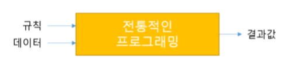
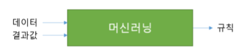
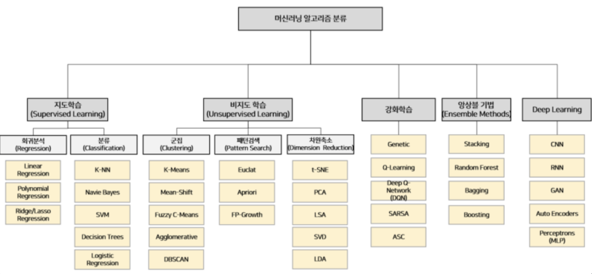
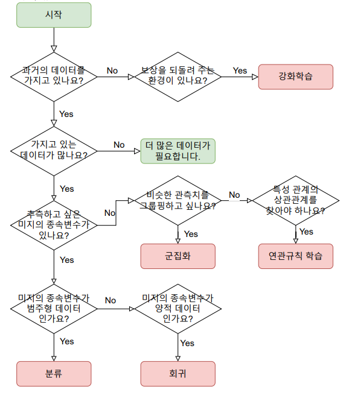
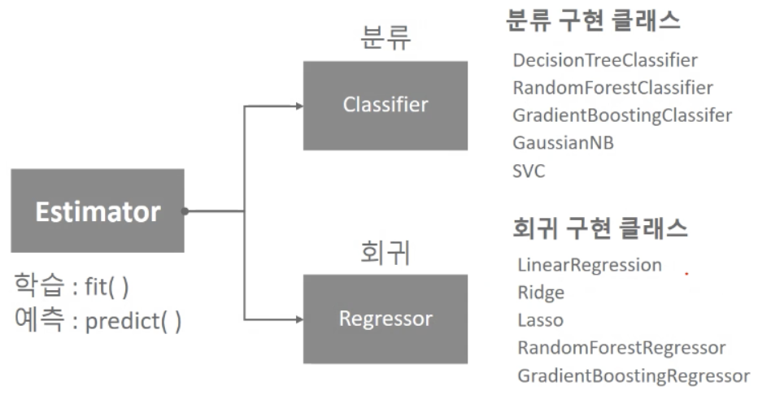
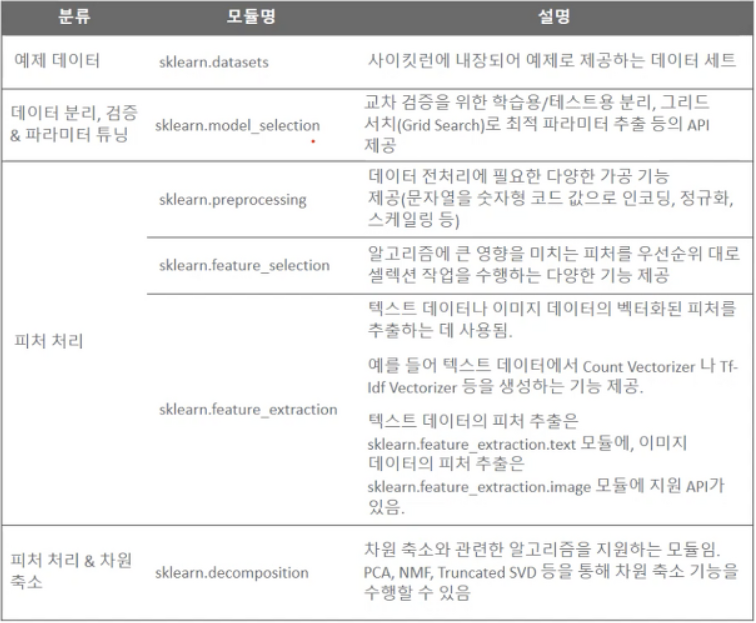
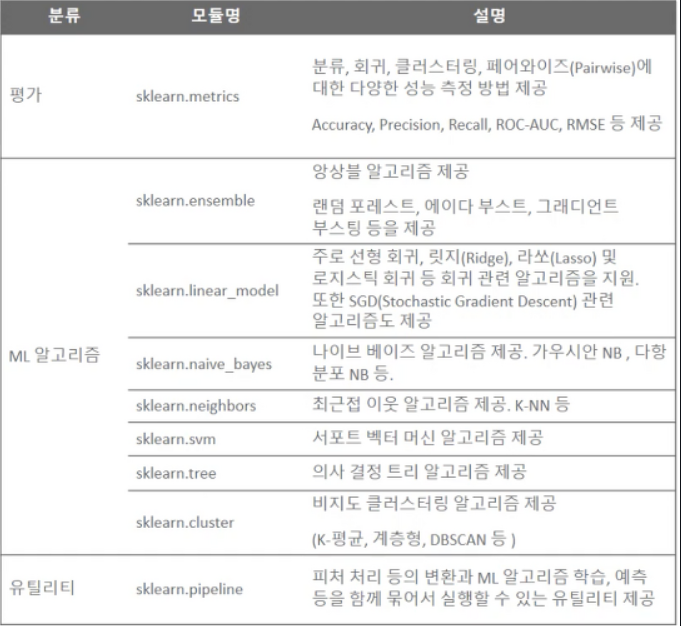
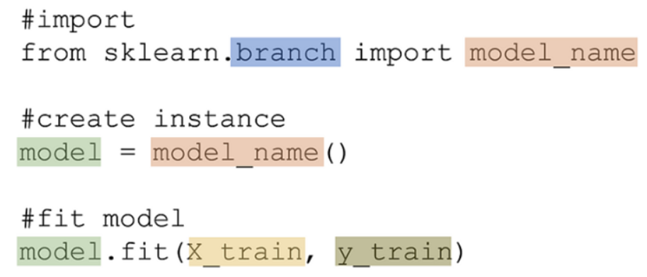

# 머신러닝의 이해

## #01. 인공지능, 머신러닝, 딥러닝

### 1) 인공지능(AI)

- 컴퓨터가 인간과 같은 지능적인 행동을 할 수 있게 해주는 기법들을 연구하는 분야.

### 2) 머신러닝 (Machine Learning)

- 인공지능 연구분야의 방법론 중 하나.
- 데이터를 이용해 컴퓨터가 어떤 지식이나 패턴을 학습하는 것.
- 지도학습, 비지도학습, 강화학습 등의 방법론(알고리즘)이 있음.
- 대표적인 파이썬 패키지: sklearn

### 3) 딥러닝 (Deep Learning)

- 머신러닝의 여러 방법론 중 하나.
- 인공신경망을 깊게 여러 층 쌓아 올려 학습하는 방식
- 대표적인 파이썬 패키지 : Tensorflow

## #02. 전통적인 프로그래밍과 머신러닝의 차이

### 1) 프로그래밍

논리적인 흐름을 만드는 것이 중요함.

### 2) 심볼릭 AI

명시적인 규칙을 충분하게 만들어 지식을 다루면 인간 수준의 인공지능을 만들 수 있다고 생각하는 방법.

if문의 복잡한 구성

1950년대~1980년대까지의 지배적인 패러다임

### 3) 머신러닝

데이터와 결과값을 통하여 규칙을 찾아내는 것이 목적.

## #03. 머신러닝의 분류

### 1) 알고리즘 분류

#### 지도학습

의도하는 결과가 있을 때 사용

학습하는 동안 모델은 입력으로 들어온 값으로 변수를 조정하여 출력에 매핑한다.

이미 알려진 사례를 바탕으로 일반화된 모델을 만들어 의사 결정 프로세스를 자동화하는 것

알고리즘에 입력과 기대되는 출력을 제공하고 알고리즘은 주어진 입력에서 원하는 출력을 만드는 방법을 찾는다.

##### 편지 봉투에 손으로 쓴 우편번호 숫자 판별

| 구분 | 데이터 |
|--|--|
| input | 손글씨를 스캔한 이미지 |
| output | 우편번호 숫자 |

머신러닝 모델 구축에 쓸 데이터셋을 만들려면 많은 편지 봉투를 모아야 한다.

그리고 우편번호를 눈으로 확인해서 원하는 출력 값을 기록해놓아야 한다.

##### 의료 영상 이미지에 기반한 종양 판단

| 구분 | 데이터 |
|--|--|
| input | 이미지(엑스레이, CT 등) |
| output | 종양의 양성 여부 |

모델 구축에 사용할 데이터셋을 만들려면 의료 영상 데이터베이스와 전문가의 의견이 필요

다시 말해 의사가 이미지를 모두 확인해서 종양이 양성인지, 아니면 악성인지 판단을 내려야 한다.

경우에 따라서는 종양이 암인지를 확인하기 위해 이미지 확인 외의 추가 분석을 해야 할 수도 있다.

##### 의심되는 신용카드 거래 감지

| 구분 | 데이터 |
|--|--|
| input | 신용카드 거래 내역 |
| output | 부정 거래인지의 여부 |

신용카드 회사라면 모든 거래 내역을 저장하고 고객이 잘못된 거래라고 신고한 내역을 기록해서 데이터셋을 만들 수 있다.

#### 비지도학습

의도하는 결과가 없을 때 사용한다.

입력 데이터 집합을 비슷한 유형의 집합으로 분류한다.

##### 블로그 글의 주제 구분

많은 양의 텍스트 데이터를 요약하고 그 안에 담긴 핵심 주제를 찾고자 할 수 있다.

사전에 어떤 주제인지 알지 못하고 얼마나 많은 주제가 있는지도 모른다.

그러므로 출력 값을 준비할 수 없다.

##### 고객들을 취향이 비슷한 그룹으로 묶기

고객 데이터를 이용해서 어떤 고객들의 취향이 비슷한지 알고 싶거나 비슷한 취향의 고객을
그룹으로 묶고 싶은 경우 사용함

쇼핑 사이트라면 부모, 독서광, 게이머 같은 그룹이 있을 수 있다.

어떤 그룹이 있는지 미리 알 수 없고 얼마나 많은 그룹이 있는지도 모르니 출력을 가지고 있지 않은 셈이다.

##### 비정상적인 웹사이트 접근 탐지

일상적이지 않은 접근 패턴을 찾으면 부정행위나 버그를 구별하는 데 도움이 된다.

각각의 비정상 패턴은 서로 많이 다를 수 있고 이미 가지고 있는 비정상 데이터도 없을 수 있다.

이 경우 단지 웹 트래픽만 관찰할 수 있고 어떤 것이 정상이고 비정상인지 알지 못하므로 비지도 학습 문제이다.

#### 강화학습

- 결정을 내리도록 할 때 사용한다.
- 결정을 했을 때의 성공/실패에 따라 주어진 입력값에 대한 결정이 점차 달라진다.
- 학습을 할 수록 입력에 대한 결과 예측이 가능하게 된다.

### 2) 분석 목적에 따른 알고리즘 구분

### 3) 결론

| 구분 | 목적 |
|---|---|
| 통계분석 | 소수(샘플,표본)에서 다수(모집단)을 추정한다. |
| 빅데이터 분석 | 컴퓨팅 파워의 발전으로 표본집단의 선정이 의미 없어짐 |
| 머신러닝 | 과거로부터 미래를 예측한다. |

## #04. 사이킷 런(Scikit-learn) 소개

2007년도 구글 하계 코드 프로젝트 모임에 참여한 몇몇 개발자들이 중심이 되어 시작된 라이브러리

지도학습, 비지도학습을 위한 다양한 모델을 제공

이 모델을 위한 시각화 도구, 교차 검증 도구들까지 매우 광범위한 기능을 제공

하지만 딥러닝은 제공 안함

### [1] sklearn의 핵심 기능

#### (1) 주요 기능 분류

#### (2) 주요 하위 모듈

### [2] sklearn의 코드 패턴

| 구분 | 설명 |
|---|---|
| branch | 사용하고자 하는 알고리즘이 구현된 클래스를 담고 있는 패키지 |
| model_name | 사용하고자 하는 알고리즘이 구현된 클래스 |
| model | 알고리즘에 따라 계산을 수행할 수 있는 객체 |

model 객체가 갖는 `fit()` 메서드에 독립변수(`X_train`), 종속변수(`Y_train`)을 전달하여 독립변수와 종속변수간의 관계를 찾아내는 과정

### [3] sklearn을 위한 선행 지식

> Tensorflow등을 포함한 모든 머신러닝 패키지에 공통적으로 해당되는 사항

- Numpy
- Scipy
- Pandas
- Matplotlib
- Seaborn